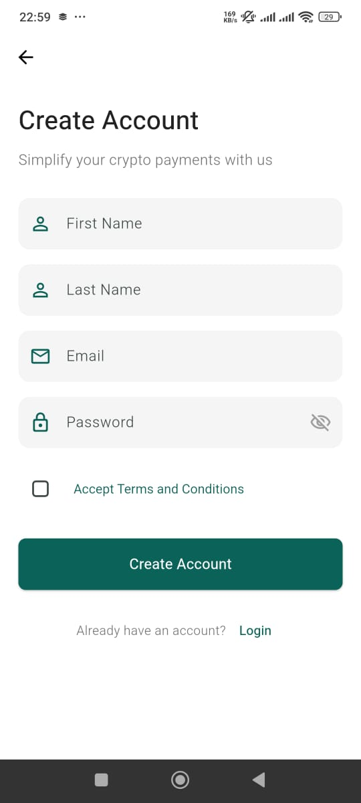

# Pretium Finance


Pretium Finance is a mobile financial application built with Flutter that enables users to manage digital payments and financial transactions seamlessly. The app provides a simple yet powerful interface for handling money transfers, purchasing airtime, paying bills, and buying goods.

## Features

### Authentication

- **User Registration**: Sign up with first name, last name, and email
- **Secure Login**: Password-protected with "Remember Me" functionality
- **Account Verification**: Verification process to confirm user identity

### Wallet Management

- **Balance Display**: View your current wallet balance in KES with USD equivalent
- **Transaction History**: Chronological list of all financial activities
- **Balance Protection**: Option to hide balance for privacy

### Financial Services

- **Send Money**: Transfer funds to other users via phone number or email
- **Buy Goods**: Make purchases at merchant locations using a business number
- **Pay Bills**: Clear utility bills and other payments through business accounts
- **Buy Airtime**: Purchase mobile airtime for multiple telecom providers
  - Supported networks: Safaricom, Airtel, Telkom, Faiba

### User Experience

- **Personalized Dashboard**: Quick access to all services and recent transactions
- **Custom Notifications**: Rich notification system with elegant display
- **User Profile**: Manage personal details and app settings
- **Multi-Currency Support**: View balances in local currency and USD equivalent

## Screenshots
I have included some screenshots of the app below:
### Login Screen


### SignUp Screen


### Splash Screen


### Dashboard Screen


### Profile Setting Screen


### Pay Bill Slider Screen


### Direct Pay Slider Screen


### Account Payment Slider Screen


## Technical Specifications

### Platforms

- Android
- iOS
- Web
- Windows
- macOS (requires macOS system for building)
- Linux

### Core Technologies

- **Framework**: Flutter
- **Language**: Dart
- **Storage**: Local secure storage for user data and transactions
- **UI**: Material Design 3 with custom components

### Dependencies

- `flutter_launcher_icons`: For app icon generation across platforms
- `shared_preferences`: For local data persistence
- `intl`: For date formatting and localization
- `url_launcher`: For external URL handling

## Installation

### Prerequisites

- Flutter SDK (latest stable version)
- Dart SDK
- Android Studio / VS Code with Flutter plugins
- Git

### Clone and Install

```bash
# Clone the repository
git clone https://github.com/Faqih001/pretium_finance

# Navigate to the project directory
cd pretium_finance

# Install dependencies
flutter pub get

# Run the application
flutter run
```

### Build for Production

```bash
# Build for Android
flutter build apk --release

# Build for iOS (requires macOS)
flutter build ios --release

# Build for Web
flutter build web --release

# Build for Windows
flutter build windows --release

# Build for Linux
flutter build linux --release
```

## Project Architecture

The application follows a modular architecture with clear separation of concerns:

- `lib/models/`: Data models including Transaction
- `lib/screens/`: UI screens for different app features
- `lib/services/`: Business logic and services including:
  - `storage_service.dart`: Data persistence management
  - `notification_service.dart`: Custom notification implementation
- `lib/widgets/`: Reusable UI components
- `assets/`: App images, icons, and other static resources

## Future Roadmap

- **Biometric Authentication**: Fingerprint and face recognition
- **International Transfers**: Support for cross-border transactions
- **Investment Features**: Options to invest in various financial instruments
- **Crypto Integration**: Support for cryptocurrency transactions
- **Expense Analytics**: Visual reports and insights on spending habits
- **Group Payments**: Split bills and make group collections

## Contributing

We welcome contributions to the Pretium Finance project!

1. Fork the repository
2. Create your feature branch (`git checkout -b feature/amazing-feature`)
3. Commit your changes (`git commit -m 'Add some amazing feature'`)
4. Push to the branch (`git push origin feature/amazing-feature`)
5. Open a Pull Request

## License

This project is licensed under the MIT License - see the LICENSE file for details.

## Contact

Project Maintainer: [Fakii Mohammed](mailto:fakiiahmad001@gmail.com)

---

Developed with ❤️ by Fakii Mohammed
